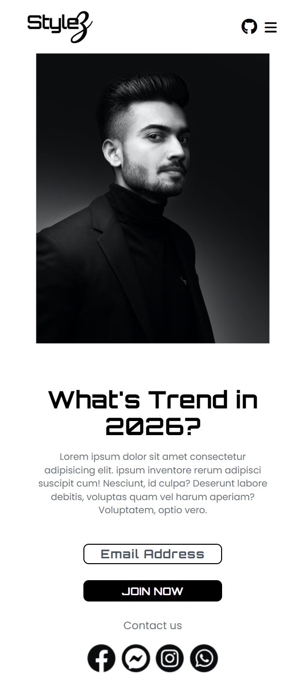
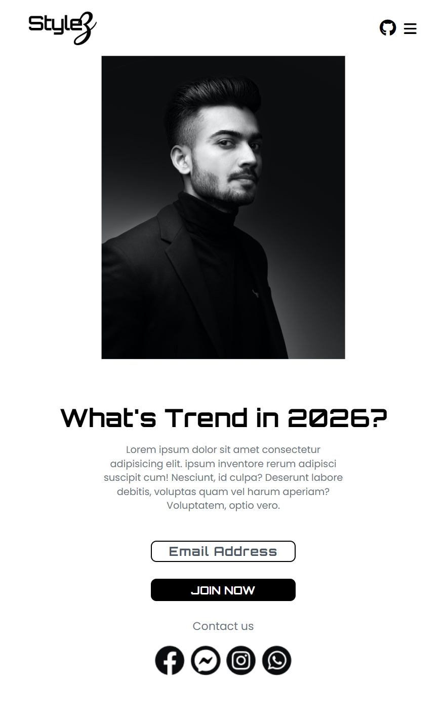
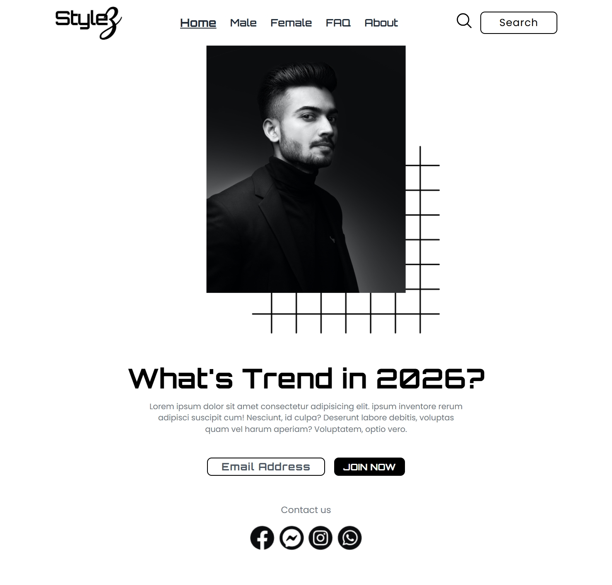

Here is a **clean README.md** you can use for your project.

# StyleZ – Fashion Landing Page

A modern and responsive **fashion landing page** built using **HTML and Tailwind CSS**.
This project showcases a stylish hero section, responsive navigation bar, and modern typography using Google Fonts.

---

## 🚀 Features

* Responsive navigation bar
* Modern hero section layout
* Custom Google Fonts integration
* Tailwind CSS utility-based styling
* Font Awesome icons
* Fully responsive design
* Clean and minimal UI

---
## Preview






## 🛠️ Built With

* **HTML5**
* **Tailwind CSS (CDN)**
* **Google Fonts**
* **Font Awesome Icons**

---

## 📂 Project Structure

```
StyleZ/
│
├── index.html
├── README.md
│
└── assets/
    ├── logo.png
    ├── Image.png
    ├── globe.png
    ├── star.png
    ├── squares.png
    ├── Group.png
    ├── Group (1).png
    ├── Group (2).png
    └── Group (3).png
```

---

## 📸 Preview

Landing page includes:

* Navigation bar with logo and menu
* Hero section with fashion model image
* Decorative elements (globe, star)
* Email signup button
* Social media icons

---

## 🌐 Fonts Used

* **Poppins**
* **Orbitron**
* **Dancing Script**

These fonts are imported from **Google Fonts**.

---

## 📱 Responsive Design

The layout adapts to:

* Mobile devices
* Tablets
* Laptops
* Large screens

Tailwind breakpoints used:

```
sm
md
lg
xl
```

---

## 📌 Future Improvements

* Mobile navigation menu
* Email input field functionality
* Product showcase section
* Animations and hover effects
* Dark mode support

---


## 👨‍💻 Author

Developed by **Zareel Kalam**

---


